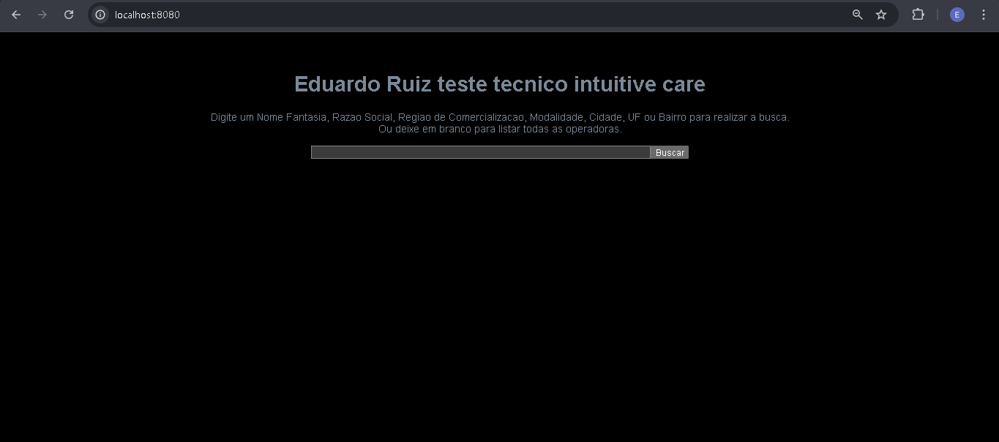

# Etapa 4 - Frontend Teste Técnico IntuitiveCare

Este projeto é parte de um teste técnico para a IntuitiveCare.

## Requisitos

- Node.js (versão 14 ou superior)
- Gerenciador de pacotes npm
- Servidor backend rodando na porta 5000 com o endpoint `/operadoras`

## Como executar o projeto

1. Certifique-se de que o servidor backend está rodando na porta 5000.
2. Instale as dependências do projeto utilizando o gerenciador de pacotes:
   ```bash
   npm install
   ```
3. Inicie o servidor utilizando o comando:
   ```bash
   npm run serve
   ```
4. A página deve rodar na url localhost:8080

## Execução
1. Você conseguirá fazer as consultas nos campos através do campo de busca.

## Prints de funcionamento
### Página rodando na url localhost:8080

### Buscando todas as operadoras

### Buscando operadora por Cidade

### Erro ao tentar realizar uma busca com o servidor inativo
